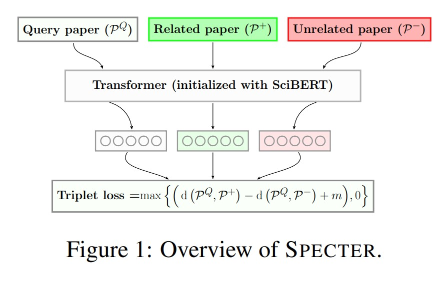
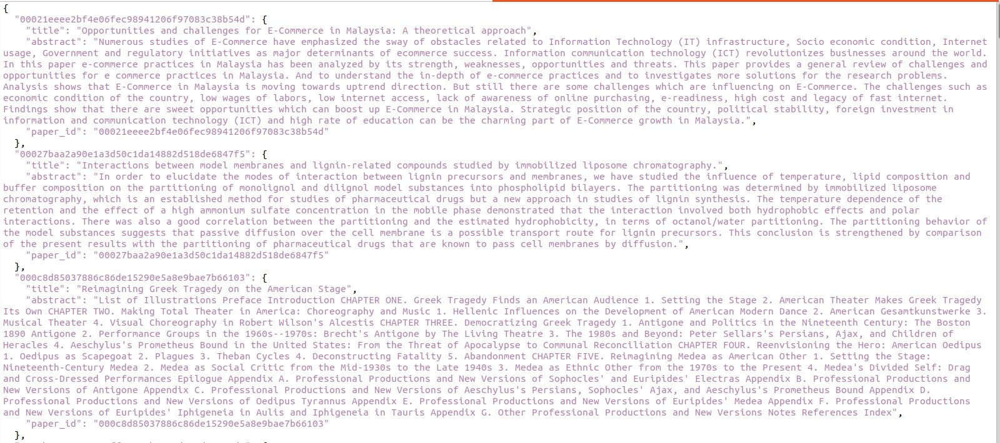
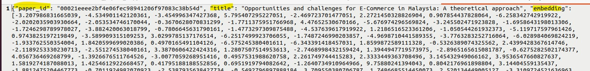

## 论文背景
本工程参考以下论文实现：
> 标题：SPECTER: Document-level Representation Learning using Citation-informed Transformers  
> 摘要：表示学习是自然语言处理系统的关键组成部分。像BERT这样的最新Transformer语言模型学习了强大的文本表示，但这些模型针对标记和句子级别的训练目标，并不利用相关性信息，这限制了它们在文档级表示方面的能力。对于科学文献的应用，如分类和推荐，嵌入提供了强大的终端任务性能。我们提出了SPECTER，一种基于预训练Transformer语言模型的科学文档的文档级嵌入生成方法，其依据一个强大的文档级相关性信号：引用图。与现有的预训练语言模型不同，SPECTER可以轻松地应用于下游应用，而无需特定任务的微调。此外，为了鼓励进一步的文档级模型研究，我们引入了SciDocs，一个新的评估基准，包括七个文档级任务，从引文预测到文档分类和推荐。我们展示了SPECTER在基准测试上优于各种竞争基线。  

本模型是基于tramsformer的科学杂志搜索模型，具体而言，本模型可以通过文档的标题和摘要来获取文档的语义，再通过比较文档的语义来判断两个文档是否是相似研究方向的paper。
## 模型实现原理
### 创新性
- 文档级别表示学习：相对于传统的基于词汇或句子级别的表示学习方法，SPECTER 专注于学习文档级别的表示。这种方法能够更全面地捕捉文档的语义信息，并提供更好的上下文理解。
- transformer预训练模型：使用transformer模型，比bert模型取得更加优异的成绩。
### 模型框架
- Query paper是指目标论文，也就是我们选择的论文方向的论文。
- Related paper是相关的论文，最简单就是直接看参考文献有哪些论文，但是实际上还要看参考文献论文的参考文献论文，从而形成一个related paper图。
- Unrelated paper：不相关的论文，作为负例，了解和识别这些"unrelated paper"也是重要的。这有助于我们更好地理解研究领域的边界，并排除那些与我们研究方向无关的文献，将精力集中在与我们的研究直接相关的内容上。
- Transformer模型：本模型没有展开，应该是直接调用。想要了解transformer具体结构，可以看另外一篇（有图）
- 经过transformer预训练，会得到三个向量，分别表示三类论文。
- Triplet loss是一种用于学习嵌入空间的损失函数，常用于度量学习和相似性学习任务中。在度量学习任务中，我们希望将具有相同标签或相似性质的样本映射到靠近的区域，而将不同标签或不相似性质的样本分开。Triplet loss通过定义三元组（triplet）来实现这个目标，并利用这些三元组的信息来优化模型。
每个三元组由三个样本组成：一个锚点样本（anchor）、一个正样本（positive）和一个负样本（negative）。其中，锚点样本与正样本属于同一类别或具有相似性质，而负样本与锚点样本则属于不同类别或具有不相似性质。
Triplet loss的目标是使锚点样本与正样本之间的距离尽可能小，并使锚点样本与负样本之间的距离尽可能大。这个公式的含义是想要获取让相似的论文的余弦距离最小，而不相关的论文的余弦距离最大的一个loss值。其中d是计算两个向量的余弦距离，也可以使用汉明距离。m是margin，是一个预先定义的边界值，用于控制正样本和负样本之间的距离差异。通过最小化Triplet loss，模型可以学习到更好的嵌入表示，使得同一类别或相似性质的样本在嵌入空间中更加接近，而不同类别或不相似性质的样本则更远离。


### 模型解释
- 模型输入（embed.py脚本运行为例，大家也可以写自己的脚本，也可以用这个）：一个字典结构的数据单元，包含论文标题，摘要，在文件./data/sample-metadata.json里。如图


- 模型输出：输出所有论文的向量表示，也是字典结构。这里截取第一个数据

我们可以直接将数据进行dot操作获得其相似度,以下有我进行实验的一个简单代码。
在实验前，我们先解释模型输出的数据。
一开始的一串数字是论文id，这个是每一个论文唯一的，但是数字本身没什么实际意义。本文选择id的方式是论文网页的链接后n位。换成其他的也一样，如下图。（但是这些id在./data/sample.ids里有注册的，修改id的话，这个文件也应该一并修改），然后就是标题和生成的embedding，这个embedding代表着文章的语义。


由于不知道这些论文那些是相似的，我先选取了两个相似的论文来替代文件./data/sample-metadata.json中前两个论文，下面是我更改的文章（可以替换此文件的两篇文章）。
```
{
  "00021eeee2bf4e06fec98941206f97083c38b54d": {
    "title": "Clone-hunter: accelerated bound checks elimination via binary code clone detection",
    "abstract": "Unsafe pointer usage and illegitimate memory accesses are prevalent bugs in software. To ensure memory safety, conditions for array bound checks are inserted into the code to detect out-of-bound memory accesses. Unfortunately, these bound checks contribute to high runtime overheads, and therefore, redundant array bound checks should be removed to improve application performance. In this paper, we propose Clone-Hunter, a practical and scalable framework for redundant bound check elimination in binary executables. Clone-Hunter first uses binary code clone detection, and then employs bound safety verification mechanism (using binary symbolic execution) to ensure sound removal of redundant bound checks. Our results show the Clone-Hunter can swiftly identify redundant bound checks about 90× faster than pure binary symbolic execution, while ensuring zero false positives.",
    "paper_id": "00021eeee2bf4e06fec98941206f97083c38b54d"
  },
  "00027baa2a90e1a3d50c1da14882d518de6847f5": {
    "title": "BinMatch: A Semantics-Based Hybrid Approach on Binary Code Clone Analysis",
    "abstract": "Binary code clone analysis is an important technique which has a wide range of applications in software engineering (e.g., plagiarism detection, bug detection). The main challenge of the topic lies in the semantics-equivalent code transformation (e.g., optimization, obfuscation) which would alter representations of binary code tremendously. Another challenge is the trade-off between detection accuracy and coverage. Unfortunately, existing techniques still rely on semantics-less code features which are susceptible to the code transformation. Besides, they adopt merely either a static or a dynamic approach to detect binary code clones, which cannot achieve high accuracy and coverage simultaneously. In this paper, we propose a semantics-based hybrid approach to detect binary clone functions. We execute a template binary function with its test cases, and emulate the execution of every target function for clone comparison with the runtime information migrated from that template function. The semantic signatures are extracted during the execution of the template function and emulation of the target function. Lastly, a similarity score is calculated from their signatures to measure their likeness. We implement the approach in a prototype system designated as BinMatch which analyzes IA-32 binary code on the Linux platform. We evaluate BinMatch with eight real-world projects compiled with different compilation configurations and commonly-used obfuscation methods, totally performing over 100 million pairs of function comparison. The experimental results show that BinMatch is robust to the semantics-equivalent code transformation. Besides, it not only covers all target functions for clone analysis, but also improves the detection accuracy comparing to the state-of-the-art solutions.",
    "paper_id": "00027baa2a90e1a3d50c1da14882d518de6847f5"
  },

```
我们用替换后的数据来运行embed.py脚本，并计算第一篇文章和其他文章的dot值，可以得到与第二篇文章的分数最高。计算方法如下
```
import json
import numpy as np
vector=[]
with open('output.jsonl', 'r') as fcc_file:
    for line in fcc_file: 
        fcc_data = json.loads(line)
        vector.append(fcc_data)
#result=np.dot(fcc_data["embedding"],fcc_data["embedding"])
## find the simplify paper of the first one 
grade=[]
for v in vector:
    grade.append(np.dot(vector[0]["embedding"],v["embedding"]))
grade=np.array(grade)
ranking=np.argsort(-grade)
print(ranking) ## 输出排名
```
结果如下,可以看到前两个文章的排名靠前，其中第一篇是文章本身，第二篇是我们选取的相似文章。证明这个模型确实有效，以上代码可以在项目文件夹新建dot.py文件复制粘贴使用。
```
(specter) user@ubuntu:~/model/model2/specter$ python dot.py 
[ 0  1 11 37  9 26 41 21 27 46 29 45 20 53 43 23 54  4 33 10 31 22 34 16
 51 25 13 48  2 49  8 18 14 36  6  3 39 30 24 32 19  7 28 15 12  5 40 38
 42 47 17 35 52 50 44]
```
## 安装

### 一、安装模型
>  Python 3.6+, PyTorch 1.1.0+, TensorFlow 2.0+, and Flax.
#### 通过Github仓库安装
##### 1. 下载
```
## git clone git@github.com:allenai/specter.git
git clone https://github.com/allenai/specter.git
cd specter
## 通过浏览器下载archive.tar.gz更快
wget https://ai2-s2-research-public.s3-us-west-2.amazonaws.com/specter/archive.tar.gz
tar -xzvf archive.tar.gz
```
##### 2. 安装环境
```shell
## 先安装conda，记住运行Anaconda.sh安装脚本时不要在root下运行，不然默认装到/root下，虽然在安装时选择其他路径可以让user使用，但是运行代码还是有可能出错，保险起见，就user下安装即可。
conda create --name specter python=3.7 setuptools  
conda activate specter  
# if you don't have gpus, remove cudatoolkit argument
#conda install pytorch cudatoolkit=10.1 -c pytorch   
conda install pytorch cpuonly -c pytorch
## pip requirements.txt的命令最好转化成以下两条，用以在网络不好的环境下分别执行，防止一个执行了重复执行
## pip install dill jsonlines pandas scikit-learn
##https可以换成git试试
pip install -r requirements.txt  
python setup.py install
```
##### 3. 修改环境包依赖bug
运行代码报错，这是因为包的版本不对。  
allennlp                      0.9.0
overrides                     7.3.1
其中overrides版本高了，应该将其改为低版本3.1.0
###### 报错信息
```
(specter) user@ubuntu:~/model/model2/specter$ python scripts/embed.py \
> --ids data/sample.ids --metadata data/sample-metadata.json \
> --model ./model.tar.gz \
> --output-file output.jsonl \
> --vocab-dir data/vocab/ \
> --batch-size 16 \
> --cuda-device -1
Traceback (most recent call last):
  File "specter/predict_command.py", line 14, in <module>
    from allennlp.commands import ArgumentParserWithDefaults
  File "/home/user/anaconda3/envs/specter/lib/python3.7/site-packages/allennlp/commands/__init__.py", line 8, in <module>
    from allennlp.commands.configure import Configure
  File "/home/user/anaconda3/envs/specter/lib/python3.7/site-packages/allennlp/commands/configure.py", line 26, in <module>
    from allennlp.service.config_explorer import make_app
  File "/home/user/anaconda3/envs/specter/lib/python3.7/site-packages/allennlp/service/config_explorer.py", line 24, in <module>
    from allennlp.common.configuration import configure, choices
  File "/home/user/anaconda3/envs/specter/lib/python3.7/site-packages/allennlp/common/configuration.py", line 17, in <module>
    from allennlp.data.dataset_readers import DatasetReader
  File "/home/user/anaconda3/envs/specter/lib/python3.7/site-packages/allennlp/data/__init__.py", line 1, in <module>
    from allennlp.data.dataset_readers.dataset_reader import DatasetReader
  File "/home/user/anaconda3/envs/specter/lib/python3.7/site-packages/allennlp/data/dataset_readers/__init__.py", line 10, in <module>
    from allennlp.data.dataset_readers.ccgbank import CcgBankDatasetReader
  File "/home/user/anaconda3/envs/specter/lib/python3.7/site-packages/allennlp/data/dataset_readers/ccgbank.py", line 9, in <module>
    from allennlp.data.dataset_readers.dataset_reader import DatasetReader
  File "/home/user/anaconda3/envs/specter/lib/python3.7/site-packages/allennlp/data/dataset_readers/dataset_reader.py", line 8, in <module>
    from allennlp.data.instance import Instance
  File "/home/user/anaconda3/envs/specter/lib/python3.7/site-packages/allennlp/data/instance.py", line 3, in <module>
    from allennlp.data.fields.field import DataArray, Field
  File "/home/user/anaconda3/envs/specter/lib/python3.7/site-packages/allennlp/data/fields/__init__.py", line 7, in <module>
    from allennlp.data.fields.array_field import ArrayField
  File "/home/user/anaconda3/envs/specter/lib/python3.7/site-packages/allennlp/data/fields/array_field.py", line 10, in <module>
    class ArrayField(Field[numpy.ndarray]):
  File "/home/user/anaconda3/envs/specter/lib/python3.7/site-packages/allennlp/data/fields/array_field.py", line 49, in ArrayField
    @overrides
  File "/home/user/anaconda3/envs/specter/lib/python3.7/site-packages/overrides/overrides.py", line 83, in overrides
    return _overrides(method, check_signature, check_at_runtime)
  File "/home/user/anaconda3/envs/specter/lib/python3.7/site-packages/overrides/overrides.py", line 170, in _overrides
    _validate_method(method, super_class, check_signature)
  File "/home/user/anaconda3/envs/specter/lib/python3.7/site-packages/overrides/overrides.py", line 189, in _validate_method
    ensure_signature_is_compatible(super_method, method, is_static)
  File "/home/user/anaconda3/envs/specter/lib/python3.7/site-packages/overrides/signature.py", line 102, in ensure_signature_is_compatible
    ensure_return_type_compatibility(super_type_hints, sub_type_hints, method_name)
  File "/home/user/anaconda3/envs/specter/lib/python3.7/site-packages/overrides/signature.py", line 303, in ensure_return_type_compatibility
    f"{method_name}: return type `{sub_return}` is not a `{super_return}`."
TypeError: ArrayField.empty_field: return type `None` is not a `<class 'allennlp.data.fields.field.Field'>`.
```
###### 修改代码
```
pip install allennlp==3.1.0
```
##### 4. 运行代码
此时再次运行以上代码，模型正常工作
脚本的输出大概是如下格式：


### 二、模型虚拟环境版本存档
```
(specter) user@ubuntu:~/model/model2/specter$ pip list
Package                       Version
----------------------------- ---------
alabaster                     0.7.13
allennlp                      0.9.0
attrs                         23.1.0
Babel                         2.12.1
blis                          0.2.4
boto3                         1.26.158
botocore                      1.29.158
certifi                       2022.12.7
charset-normalizer            3.1.0
click                         8.1.3
conllu                        1.3.1
cycler                        0.11.0
cymem                         2.0.7
dill                          0.3.6
docutils                      0.19
editdistance                  0.6.2
exceptiongroup                1.1.1
flaky                         3.7.0
Flask                         2.2.5
Flask-Cors                    3.0.10
fonttools                     4.38.0
ftfy                          6.1.1
gevent                        22.10.2
greenlet                      2.0.2
h5py                          3.8.0
idna                          3.4
imagesize                     1.4.1
importlib-metadata            6.7.0
iniconfig                     2.0.0
itsdangerous                  2.1.2
Jinja2                        3.1.2
jmespath                      1.0.1
joblib                        1.2.0
jsonlines                     3.1.0
jsonnet                       0.20.0
jsonpickle                    3.0.1
kiwisolver                    1.4.4
MarkupSafe                    2.1.3
matplotlib                    3.5.3
murmurhash                    1.0.9
nltk                          3.8.1
numpy                         1.21.6
numpydoc                      1.5.0
overrides                     3.1.0
packaging                     23.1
pandas                        1.3.5
parsimonious                  0.10.0
Pillow                        9.5.0
pip                           22.3.1
plac                          0.9.6
pluggy                        1.2.0
preshed                       2.0.1
protobuf                      4.23.3
Pygments                      2.15.1
pyparsing                     3.1.0
pytest                        7.3.2
python-dateutil               2.8.2
pytorch-pretrained-bert       0.6.2
pytorch-transformers          1.1.0
pytz                          2023.3
PyYAML                        6.0
regex                         2023.6.3
requests                      2.31.0
responses                     0.23.1
s3transfer                    0.6.1
scikit-learn                  1.0.2
scipy                         1.7.3
sentencepiece                 0.1.99
setuptools                    65.6.3
six                           1.16.0
snowballstemmer               2.2.0
spacy                         2.1.9
specter                       0.0.1
Sphinx                        5.3.0
sphinxcontrib-applehelp       1.0.2
sphinxcontrib-devhelp         1.0.2
sphinxcontrib-htmlhelp        2.0.0
sphinxcontrib-jsmath          1.0.1
sphinxcontrib-qthelp          1.0.3
sphinxcontrib-serializinghtml 1.1.5
sqlparse                      0.4.4
srsly                         1.0.6
tensorboardX                  2.6.1
thinc                         7.0.8
threadpoolctl                 3.1.0
tomli                         2.0.1
torch                         1.13.1
tqdm                          4.65.0
types-PyYAML                  6.0.12.10
typing_extensions             4.1.1
Unidecode                     1.3.6
urllib3                       1.26.16
wasabi                        0.10.1
wcwidth                       0.2.6
Werkzeug                      2.2.3
wheel                         0.38.4
word2number                   1.1
zipp                          3.15.0
zope.event                    4.6
zope.interface                6.0

```
## 模型使用
```
(specter) user@ubuntu:~/model/model2/specter$ python scripts/embed.py \
> --ids data/sample.ids --metadata data/sample-metadata.json \
> --model ./model.tar.gz \
> --output-file output.jsonl \
> --vocab-dir data/vocab/ \
> --batch-size 16 \
> --cuda-device -1
```
复制粘贴上文的dot.py或者自己写一个向量dot的脚本均可（下一个命令是用我的dot.py来实现的，大家也可以自由发挥）
```
(specter) user@ubuntu:~/model/model2/specter$ python dot.py 
```

## 参考文献 && 引用项目
技术文档：https://www.sbert.net/docs/pretrained_models.html  
论文：SPECTER: Document-level Representation Learning using Citation-informed Transformers  
仓库：https://github.com/allenai/specter  