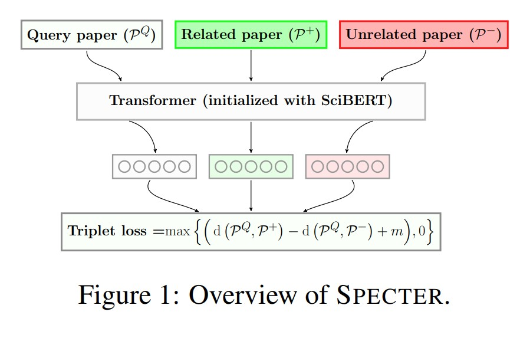
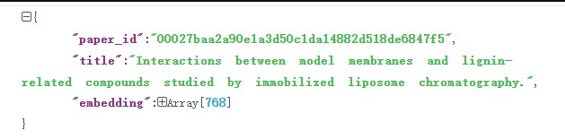
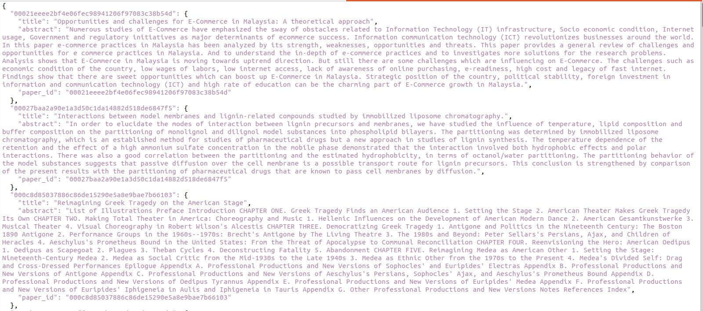
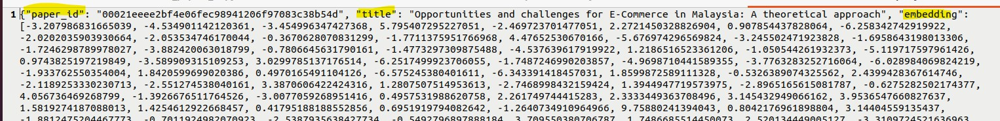
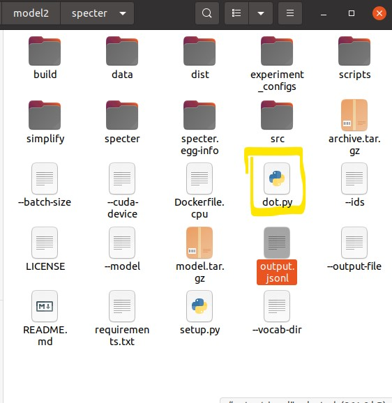
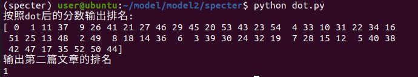

## 实验目的
1. 了解transformer等最新大数据模型的基本架构和应用方式
2. 掌握深度学习模型使用技巧
3. 能够运用soecter实现简化文献阅读工作，将大模型应用于生活和学习中
## 实验要求
1. 安装conda、python实验环境
2. 运行specter现有模型得到科学文献的语义向量
3. 制作简易数据集，通过模型寻找与目标文献（自选）研究内容最接近的文献。
## 实验原理
本模型是基于tramsformer的科学杂志搜索模型，具体而言，本模型可以通过文档的标题和摘要来获取文档的语义，再通过比较文档的语义来判断两个文档是否是相似研究方向的paper。

### 模型框架
- Query paper是指目标论文，也就是我们选择的论文方向的论文。
- Related paper是相关的论文，最简单就是直接看参考文献有哪些论文，但是实际上还要看参考文献论文的参考文献论文，从而形成一个related paper图。
- Unrelated paper：不相关的论文，作为负例，了解和识别这些"unrelated paper"也是重要的。这有助于我们更好地理解研究领域的边界，并排除那些与我们研究方向无关的文献，将精力集中在与我们的研究直接相关的内容上。
- Transformer模型：本模型没有展开，应该是直接调用。想要了解transformer具体结构，可以看另外一篇（有图）
- 经过transformer预训练，会得到三个向量，分别表示三类论文。
- Triplet loss是一种用于学习嵌入空间的损失函数，常用于度量学习和相似性学习任务中。在度量学习任务中，我们希望将具有相同标签或相似性质的样本映射到靠近的区域，而将不同标签或不相似性质的样本分开。Triplet loss通过定义三元组（triplet）来实现这个目标，并利用这些三元组的信息来优化模型。
每个三元组由三个样本组成：一个锚点样本（anchor）、一个正样本（positive）和一个负样本（negative）。其中，锚点样本与正样本属于同一类别或具有相似性质，而负样本与锚点样本则属于不同类别或具有不相似性质。
Triplet loss的目标是使锚点样本与正样本之间的距离尽可能小，并使锚点样本与负样本之间的距离尽可能大。这个公式的含义是想要获取让相似的论文的余弦距离最小，而不相关的论文的余弦距离最大的一个loss值。其中d是计算两个向量的余弦距离，也可以使用汉明距离。m是margin，是一个预先定义的边界值，用于控制正样本和负样本之间的距离差异。通过最小化Triplet loss，模型可以学习到更好的嵌入表示，使得同一类别或相似性质的样本在嵌入空间中更加接近，而不同类别或不相似性质的样本则更远离。



##################################
## 实验环境要求
ubuntu22虚拟机，anaconda虚拟环境，Python 3.7
## 实验环境部署
### 一. 安装vmware或者virtualbox虚拟机软件（有虚拟机环境则跳过）
### 二. 安装ubuntu 22的虚拟机（有ubuntu环境则跳过）
### 三. 在ubuntu中安装anaconda用于管理python包版本
由于我们在ubuntu虚拟机中要安装多个模型，不同模型所要求的python包版本有所不同，所以我们在这里选取了anaconda虚拟环境来隔绝这些模型，使得他们不互相干扰。  
如果同学们不想安装anaconda，也可以在不同的虚拟机上分别跑不同环境的模型。但是我们不推荐在同一个python包版本下跑多个模型，因为此时包版本管理将会混乱。

**前面三步，在浏览器上有多个详细教程，同学们可自行谷歌，这里不再赘述。**
### 四. 安装git命令并且克隆代码仓库
我们的目的是将github上的项目放到本地使用。  
需要运行以下命令，此时我们需要较好的网络环境，不然有可能下载失败。
```
sudo apt-get install git
git clone https://github.com/allenai/specter.git
cd specter
wget https://ai2-s2-research-public.s3-us-west-2.amazonaws.com/specter/archive.tar.gz
tar -xzvf archive.tar.gz
```
此时我们命令行已经在specter文件夹内了，使用ll命令，可以进一步观察文件夹内部信息。
### 五. 部署python环境
可以观察到我们下载的项目是由python编写，所以我们需要安装python并且下载指定版本的包来运行项目。
```
conda create --name specter python=3.7 setuptools  
conda activate specter  
conda install pytorch cpuonly -c pytorch
pip install -r requirements.txt  
python setup.py install
```

这里我们安装了指定版本的python包，但是依旧有问题
其中overrides版本高了，应该将其改为低版本3.1.0,运行下面命令更改版本
```
pip install overrides==3.1.0
```
## 模型使用
此时模型已经部署完毕了，我们来尝试运行模型。
```
(specter) user@ubuntu:~/model/model2/specter$ python scripts/embed.py \
> --ids data/sample.ids --metadata data/sample-metadata.json \
> --model ./model.tar.gz \
> --output-file output.jsonl \
> --vocab-dir data/vocab/ \
> --batch-size 16 \
> --cuda-device -1
```
脚本的输出大概是如下格式，在output.jsonl文件里可以看到：




## 模型解释  
- 模型输入（embed.py脚本运行为例，大家也可以写自己的脚本，也可以用这个）：一个字典结构的数据单元，包含论文标题，摘要，在文件./data/sample-metadata.json里。如图



- 模型输出：输出所有论文的向量表示，也是字典结构。这里截取第一个数据



我们可以直接将数据进行dot操作获得其相似度,以下有我进行实验的一个简单代码。
在实验前，我们先解释模型输出的数据。
一开始的一串数字是论文id，这个是每一个论文唯一的，但是数字本身没什么实际意义。本文选择id的方式是论文网页的链接后n位。换成其他的也一样，如下图。（但是这些id在./data/sample.ids里有注册的，修改id的话，这个文件也应该一并修改），然后就是标题和生成的embedding，这个embedding代表着文章的语义。


## 检验模型正确性
我们编写一个小脚本来检验模型生成的embedding是否能够代表论文的语义。

由于不知道这些论文那些是相似的，我先选取了两个相似的论文来替代文件./data/sample-metadata.json中前两个论文，下面是我更改的文章（可以替换此文件的两篇文章）。
```
{
  "00021eeee2bf4e06fec98941206f97083c38b54d": {
    "title": "Clone-hunter: accelerated bound checks elimination via binary code clone detection",
    "abstract": "Unsafe pointer usage and illegitimate memory accesses are prevalent bugs in software. To ensure memory safety, conditions for array bound checks are inserted into the code to detect out-of-bound memory accesses. Unfortunately, these bound checks contribute to high runtime overheads, and therefore, redundant array bound checks should be removed to improve application performance. In this paper, we propose Clone-Hunter, a practical and scalable framework for redundant bound check elimination in binary executables. Clone-Hunter first uses binary code clone detection, and then employs bound safety verification mechanism (using binary symbolic execution) to ensure sound removal of redundant bound checks. Our results show the Clone-Hunter can swiftly identify redundant bound checks about 90× faster than pure binary symbolic execution, while ensuring zero false positives.",
    "paper_id": "00021eeee2bf4e06fec98941206f97083c38b54d"
  },
  "00027baa2a90e1a3d50c1da14882d518de6847f5": {
    "title": "BinMatch: A Semantics-Based Hybrid Approach on Binary Code Clone Analysis",
    "abstract": "Binary code clone analysis is an important technique which has a wide range of applications in software engineering (e.g., plagiarism detection, bug detection). The main challenge of the topic lies in the semantics-equivalent code transformation (e.g., optimization, obfuscation) which would alter representations of binary code tremendously. Another challenge is the trade-off between detection accuracy and coverage. Unfortunately, existing techniques still rely on semantics-less code features which are susceptible to the code transformation. Besides, they adopt merely either a static or a dynamic approach to detect binary code clones, which cannot achieve high accuracy and coverage simultaneously. In this paper, we propose a semantics-based hybrid approach to detect binary clone functions. We execute a template binary function with its test cases, and emulate the execution of every target function for clone comparison with the runtime information migrated from that template function. The semantic signatures are extracted during the execution of the template function and emulation of the target function. Lastly, a similarity score is calculated from their signatures to measure their likeness. We implement the approach in a prototype system designated as BinMatch which analyzes IA-32 binary code on the Linux platform. We evaluate BinMatch with eight real-world projects compiled with different compilation configurations and commonly-used obfuscation methods, totally performing over 100 million pairs of function comparison. The experimental results show that BinMatch is robust to the semantics-equivalent code transformation. Besides, it not only covers all target functions for clone analysis, but also improves the detection accuracy comparing to the state-of-the-art solutions.",
    "paper_id": "00027baa2a90e1a3d50c1da14882d518de6847f5"
  },

```
我们用替换后的数据来运行模型（与上文命令运行方法一样，不再赘述），此时我们的output.jsonl文件里的内容被更新。
我们编写一个dot.py的脚本，放在specter项目里,位置如下



我们可以使用向量dot操作来比较两个embedding是否相似，来判断第一篇论文和第二篇论文是否相似。  
我们编写dot.py来将第一篇论文的embedding和所有论文的embdeeing相乘并且对结果排序，如果第二篇是排名第一的，那么就可以证明embedding能够用来识别相似论文。

### dot.py的参考代码如下
```
import json
import numpy as np
vector=[]
with open('output.jsonl', 'r') as fcc_file:
    for line in fcc_file: 
        fcc_data = json.loads(line)
        vector.append(fcc_data)
#result=np.dot(fcc_data["embedding"],fcc_data["embedding"])
## find the simplify paper of the first one 
grade=[]
for v in vector:
    grade.append(np.dot(vector[0]["embedding"],v["embedding"]))
grade=np.array(grade)
ranking=np.argsort(-grade)
print("按照dot后的分数输出排名:")
print(ranking) ## 输出排名
print("输出第二篇文章的排名")
print(ranking[1])
```
结果如下,可以看到前两个文章的排名靠前，其中第一篇是文章本身，第二篇是我们选取的相似文章。证明这个模型确实有效，以上代码可以在项目文件夹新建dot.py文件复制粘贴使用。



可以看到，第二篇文章排名第一，当然，细心的同学发现了还有一个排名第0的文章，那就是第一篇文章本身。

## 参考文献 && 引用项目
技术文档：https://www.sbert.net/docs/pretrained_models.html  
论文：SPECTER: Document-level Representation Learning using Citation-informed Transformers  
仓库：https://github.com/allenai/specter  
## 附录
### conda内软件包版本
```
(specter) user@ubuntu:~/model/model2/specter$ conda list
# packages in environment at /home/user/anaconda3/envs/specter:
#
# Name                    Version                   Build  Channel
_libgcc_mutex             0.1                        main    defaults
_openmp_mutex             5.1                       1_gnu    defaults
alabaster                 0.7.13                   pypi_0    pypi
allennlp                  0.9.0                    pypi_0    pypi
attrs                     23.1.0                   pypi_0    pypi
babel                     2.12.1                   pypi_0    pypi
blas                      1.0                         mkl    defaults
blis                      0.2.4                    pypi_0    pypi
boto3                     1.26.158                 pypi_0    pypi
botocore                  1.29.158                 pypi_0    pypi
ca-certificates           2023.05.30           h06a4308_0    defaults
certifi                   2022.12.7        py37h06a4308_0    defaults
charset-normalizer        3.1.0                    pypi_0    pypi
click                     8.1.3                    pypi_0    pypi
conllu                    1.3.1                    pypi_0    pypi
cpuonly                   2.0                           0    pytorch
cycler                    0.11.0                   pypi_0    pypi
cymem                     2.0.7                    pypi_0    pypi
dill                      0.3.6                    pypi_0    pypi
docutils                  0.19                     pypi_0    pypi
editdistance              0.6.2                    pypi_0    pypi
exceptiongroup            1.1.1                    pypi_0    pypi
flaky                     3.7.0                    pypi_0    pypi
flask                     2.2.5                    pypi_0    pypi
flask-cors                3.0.10                   pypi_0    pypi
fonttools                 4.38.0                   pypi_0    pypi
ftfy                      6.1.1                    pypi_0    pypi
gevent                    22.10.2                  pypi_0    pypi
greenlet                  2.0.2                    pypi_0    pypi
h5py                      3.8.0                    pypi_0    pypi
idna                      3.4                      pypi_0    pypi
imagesize                 1.4.1                    pypi_0    pypi
importlib-metadata        6.7.0                    pypi_0    pypi
iniconfig                 2.0.0                    pypi_0    pypi
intel-openmp              2023.1.0         hdb19cb5_46305    defaults
itsdangerous              2.1.2                    pypi_0    pypi
jinja2                    3.1.2                    pypi_0    pypi
jmespath                  1.0.1                    pypi_0    pypi
joblib                    1.2.0                    pypi_0    pypi
jsonlines                 3.1.0                    pypi_0    pypi
jsonnet                   0.20.0                   pypi_0    pypi
jsonpickle                3.0.1                    pypi_0    pypi
kiwisolver                1.4.4                    pypi_0    pypi
ld_impl_linux-64          2.38                 h1181459_1    defaults
libffi                    3.4.4                h6a678d5_0    defaults
libgcc-ng                 11.2.0               h1234567_1    defaults
libgomp                   11.2.0               h1234567_1    defaults
libstdcxx-ng              11.2.0               h1234567_1    defaults
markupsafe                2.1.3                    pypi_0    pypi
matplotlib                3.5.3                    pypi_0    pypi
mkl                       2023.1.0         h6d00ec8_46342    defaults
murmurhash                1.0.9                    pypi_0    pypi
ncurses                   6.4                  h6a678d5_0    defaults
nltk                      3.8.1                    pypi_0    pypi
numpy                     1.21.6                   pypi_0    pypi
numpydoc                  1.5.0                    pypi_0    pypi
openssl                   1.1.1u               h7f8727e_0    defaults
overrides                 3.1.0                    pypi_0    pypi
packaging                 23.1                     pypi_0    pypi
pandas                    1.3.5                    pypi_0    pypi
parsimonious              0.10.0                   pypi_0    pypi
pillow                    9.5.0                    pypi_0    pypi
pip                       22.3.1           py37h06a4308_0    defaults
plac                      0.9.6                    pypi_0    pypi
pluggy                    1.2.0                    pypi_0    pypi
preshed                   2.0.1                    pypi_0    pypi
protobuf                  4.23.3                   pypi_0    pypi
pygments                  2.15.1                   pypi_0    pypi
pyparsing                 3.1.0                    pypi_0    pypi
pytest                    7.3.2                    pypi_0    pypi
python                    3.7.16               h7a1cb2a_0    defaults
python-dateutil           2.8.2                    pypi_0    pypi
pytorch                   1.13.1              py3.7_cpu_0    pytorch
pytorch-mutex             1.0                         cpu    pytorch
pytorch-pretrained-bert   0.6.2                    pypi_0    pypi
pytorch-transformers      1.1.0                    pypi_0    pypi
pytz                      2023.3                   pypi_0    pypi
pyyaml                    6.0                      pypi_0    pypi
readline                  8.2                  h5eee18b_0    defaults
regex                     2023.6.3                 pypi_0    pypi
requests                  2.31.0                   pypi_0    pypi
responses                 0.23.1                   pypi_0    pypi
s3transfer                0.6.1                    pypi_0    pypi
scikit-learn              1.0.2                    pypi_0    pypi
scipy                     1.7.3                    pypi_0    pypi
sentencepiece             0.1.99                   pypi_0    pypi
setuptools                65.6.3           py37h06a4308_0    defaults
six                       1.16.0                   pypi_0    pypi
snowballstemmer           2.2.0                    pypi_0    pypi
spacy                     2.1.9                    pypi_0    pypi
specter                   0.0.1                    pypi_0    pypi
sphinx                    5.3.0                    pypi_0    pypi
sphinxcontrib-applehelp   1.0.2                    pypi_0    pypi
sphinxcontrib-devhelp     1.0.2                    pypi_0    pypi
sphinxcontrib-htmlhelp    2.0.0                    pypi_0    pypi
sphinxcontrib-jsmath      1.0.1                    pypi_0    pypi
sphinxcontrib-qthelp      1.0.3                    pypi_0    pypi
sphinxcontrib-serializinghtml 1.1.5                    pypi_0    pypi
sqlite                    3.41.2               h5eee18b_0    defaults
sqlparse                  0.4.4                    pypi_0    pypi
srsly                     1.0.6                    pypi_0    pypi
tbb                       2021.8.0             hdb19cb5_0    defaults
tensorboardx              2.6.1                    pypi_0    pypi
thinc                     7.0.8                    pypi_0    pypi
threadpoolctl             3.1.0                    pypi_0    pypi
tk                        8.6.12               h1ccaba5_0    defaults
tomli                     2.0.1                    pypi_0    pypi
tqdm                      4.65.0                   pypi_0    pypi
types-pyyaml              6.0.12.10                pypi_0    pypi
typing_extensions         4.1.1              pyh06a4308_0    defaults
unidecode                 1.3.6                    pypi_0    pypi
urllib3                   1.26.16                  pypi_0    pypi
wasabi                    0.10.1                   pypi_0    pypi
wcwidth                   0.2.6                    pypi_0    pypi
werkzeug                  2.2.3                    pypi_0    pypi
wheel                     0.38.4           py37h06a4308_0    defaults
word2number               1.1                      pypi_0    pypi
xz                        5.4.2                h5eee18b_0    defaults
zipp                      3.15.0                   pypi_0    pypi
zlib                      1.2.13               h5eee18b_0    defaults
zope-event                4.6                      pypi_0    pypi
zope-interface            6.0                      pypi_0    pypi

```