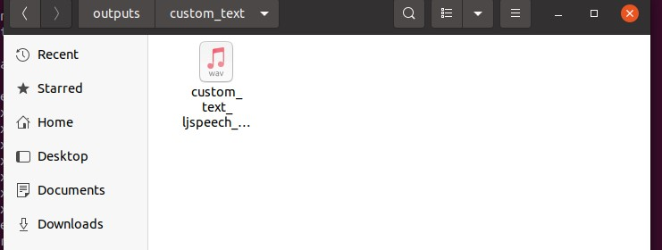

# 实验手册
## 实验目的
1. 熟悉基于transformer的TTS架构
2. 掌握transformTTS模型的安装使用方法
3. 自制数据集，利用transformerTTS模型生成高质量音频文件，探索transform模型的实际应用技巧。
## 实验要求
1. 部署transformerTTS模型环境
2. 使用transformTTS模型生成音频文件
3. 自制英文数据集，生成个性化音频文件。
## 实验环境
ubuntu22虚拟机、python3.6环境
## 实验原理
 
本模型在解决传统TTS方法的低效率和难以建模长程依赖的问题上都有创新点。通过Transform网络的思想来改进传统的TTS方法，以提高效率和语音质量；并且尝试解决低效率训练和推理、难以建模长程依赖的问题，在实验中展示了令人满意的结果。  


在transformer之前，深度学习用于实现TTS已经取得很高的性能，代表作如Tacotron2模型。而本模型在此模型上加以改进，通过使用transformer来提高训练效率。  
可以说，transformer-TTS是将Transformer和Tacotron2融合，通过transformer来处理序列化数据而不是通过深度学习传统的CNN或者RNN.

### 模型框架
模型的主体还是经典transformer，但是由于实现的是语音生成任务而非文本生成任务，在输入输出阶段稍有不同。
- 在输入阶段提前将文字序列转化为音素序列，以下图为例，通过Text-to-phone Convertor将英文文本转化成音素序列，所谓音素，是语音的最小可分辨单位，是构成语音的基本声音单元。
- 接着进入Encoder Pre-net，这一模块是transformer的一部分，其主要功能是通过一个前馈神经网络来预处理输入的语音特征序列，以提供更丰富、有用的表示给后续的编码器。
- 接着进入编码器的transformer块，它由多个子层组成，如多头自注意力层、前馈神经网络层和残差连接加归一化层。这个模块可被重复堆叠以构建更深层次的Transformer模型。
  - Multihead Attention：这是transformer中的核心组件之一，用于捕捉输入序列中的关联信息。它将输入序列分别映射到多个Attention，并通过加权平均汇总它们的输出来生成最终的上下文表示。
  - Add & Norm:
    - 添加（Addition）：将Multihead Attention的输出与输入序列进行残差连接（Residual Connection），即将Multihead Attention的输出与原始输入进行相加。
    - 归一化（Normalization）：对添加结果进行层归一化（Layer Normalization），以便更好地处理梯度流动和模型训练的稳定性。
  - 前馈神经网络（FFN）层：这是变压器块的另一个组件，用于进一步处理上一步的输出。它由两个全连接层和激活函数组成，并通过非线性变换来建模输入序列中的复杂关系。
- 接着是解码器的transformer块，与编码器类似，但一般比编码器层数要更深。
  - 在解码过程中，为了避免信息泄漏和确保自回归性质，需要对注意力机制进行掩码操作。在解码器的每个"Transformer Block"中，"masked Multihead Attention" 层用于自注意力机制，它接收来自上一层解码器的输入和额外的解码器端的上下文信息，并生成当前位置的目标序列表示。在生成当前位置的表示时，该层会使用掩码（masking）机制，将未来位置的信息屏蔽，只允许模型关注当前及其之前的位置。
  这种掩码操作确保了解码器在生成每个目标位置时，只依赖于已经生成的部分，从而满足自回归性质。通过使用掩码的 "masked Multihead Attention" 层，解码器能够逐步地生成合适的目标序列。
  需要注意的是，在编码器中没有 "masked Multihead Attention" 层，因为编码器是并行处理输入序列的，不需要考虑未来位置的信息。
- "mel linear" 模块用于将模型的输出转换为梅尔频谱表示。
梅尔频谱是一种常用的声音特征表示形式，在语音合成任务中非常重要。它将声音信号在频域进行分析，并将其映射到人耳对声音敏感的梅尔刻度上，以更好地捕捉音频信号的听觉特性。
此模块由一个线性层（linear layer）组成，用于对模型的输出进行线性变换。这个线性变换的目的是将模型输出的特征表达转换为梅尔频谱表示。
- "post-net" 模块用于对模型的生成梅尔频谱进行后处理。
在语音合成任务中，生成的梅尔频谱通常需要进行一些调整和改进，以提高合成语音的质量、自然度和清晰度。这些调整可能涉及去除噪声、增强声音细节和平滑频谱等操作。
此模块就是让语音更自然。
- Stop Linear:该模块的作用是预测在生成序列时应该停止生成的位置。在某些序列生成任务中，输出序列的长度不是固定的，而是根据输入和上下文动态生成的。因此，为了正确生成适当长度的序列，并避免生成过长或过短的结果，需要引入 "stop linear" 模块。


## 环境部署
### 1. python 3.6环境
首先安装python环境
```
conda create -n TTS36 python==3.6
conda activate TTS36  
```
### 2. github仓库
下载项目
```
git clone thub.com/as-ideas/TransformerTTS.git
cd TransformerTTS
```
### 3. pip软件包
安装软件包
```
pip install -r requirements.txt
```
```
pip install pyparsing==2.4.7
```
### 4.下载模型

[模型链接](https://public-asai-dl-models.s3.eu-central-1.amazonaws.com/TransformerTTS/api_weights/bdf06b9_ljspeech/bdf06b9_ljspeech_step_90000.zip)
在以上链接下载模型到TransformerTTS/model/model文件夹，没有对应文件夹就新建文件夹。

下载完模型解压到同一路径
## transformerTTS运行
```
(TTS36) user@ubuntu:~/model/model3/TransformerTTS$ python predict_tts.py -t "Please, say something."
```
### 模型解释
- 模型输入：一段英文文本
- 模型输出：wav文件在outputs/custom_text文件夹，是输入的英文文本的语音生成文件。如下图。注意：如果想要批量生成输出文件，需要对输出的文件名修改，否则由于输出文件都是相同名字，新文件会替代旧文件。


## 模型安装使用
```
(TTS36) user@ubuntu:~/model/model3/TransformerTTS$ python predict_tts.py -t "Please, say something." -p /home/user/model/model3/TransformerTTS/model/mobel/bdf06b9_ljspeech_step_90000/bdf06b9_ljspeech_step_90000
2023-06-23 03:48:08.648046: W tensorflow/stream_executor/platform/default/dso_loader.cc:64] Could not load dynamic library 'libcudart.so.11.0'; dlerror: libcudart.so.11.0: cannot open shared object file: No such file or directory
2023-06-23 03:48:08.648086: I tensorflow/stream_executor/cuda/cudart_stub.cc:29] Ignore above cudart dlerror if you do not have a GPU set up on your machine.
Loading model from /home/user/model/model3/TransformerTTS/model/mobel/bdf06b9_ljspeech_step_90000/bdf06b9_ljspeech_step_90000
2023-06-23 03:48:18.661162: W tensorflow/stream_executor/platform/default/dso_loader.cc:64] Could not load dynamic library 'libcuda.so.1'; dlerror: libcuda.so.1: cannot open shared object file: No such file or directory
2023-06-23 03:48:18.661202: W tensorflow/stream_executor/cuda/cuda_driver.cc:269] failed call to cuInit: UNKNOWN ERROR (303)
2023-06-23 03:48:18.661224: I tensorflow/stream_executor/cuda/cuda_diagnostics.cc:156] kernel driver does not appear to be running on this host (ubuntu): /proc/driver/nvidia/version does not exist
2023-06-23 03:48:18.687299: I tensorflow/core/platform/cpu_feature_guard.cc:142] This TensorFlow binary is optimized with oneAPI Deep Neural Network Library (oneDNN) to use the following CPU instructions in performance-critical operations:  AVX2 FMA
To enable them in other operations, rebuild TensorFlow with the appropriate compiler flags.
WARNING: git_hash mismatch: bdf06b9(config) vs 3638055(local).
Output wav under outputs/custom_text

```
此时输出的wav文件在outputs/custom_text文件夹里，我们输入的英文文本是"Please, say something."，把这句话替换成任意英文文本，来生成对应的音频文件吧。
#### 生成的音频文件如下

把文件拖拽到windows操作系统即可用媒体播放器播放，看看发音是否正确自然呢。
### 数据集获取
由于本模型所使用的输入仅为一句英文文本，所以，只需要一句英文文本来替代上文的"Please, say something."即可通过命令行调用此模型来生成任意语句的语音。无需专门制作数据集，可以使用spilt函数将英文文本划分成一个个的短句来分别生成这些句子的语音文件。
如下所示：
```
def split_sentences(text):
    # 将文章按句号划分成句子列表
    sentences = text.split('. ')
    # 在最后一个句子后添加句号
    if len(sentences) > 1 and not sentences[-1].endswith('.'):
        sentences[-1] += '.'
    return sentences
# 示例英文文章
article = "This is the first sentence. This is the second sentence. This is the third sentence."
# 调用函数将文章划分为句子列表
sentences = split_sentences(article)
## 此时的sentence已经是按照句子划分的列表了，可以对每一句话调用一次模型。模型也可以通过python代码来调用（见原github仓库），或者在代码里集成上述命令行代码来调用。
```

## 参考文章 && 引用项目
### 参考文章
Neural Speech Synthesis with Transformer Network  
FastSpeech: Fast, Robust and Controllable Text to Speech  
FastSpeech 2: Fast and High-Quality End-to-End Text to Speech  
FastPitch: Parallel Text-to-speech with Pitch Prediction  
基于Transformer的语音合成系统
### 引用项目
https://github.com/as-ideas/TransformerTTS
## 附录
### python包
```
(TTS36) user@ubuntu:~/model/model3/TransformerTTS$ pip list
Package                 Version
----------------------- ---------
absl-py                 0.15.0
astunparse              1.6.3
attrs                   22.2.0
audioread               3.0.0
cached-property         1.5.2
cachetools              4.2.4
certifi                 2023.5.7
cffi                    1.15.1
charset-normalizer      2.0.12
clang                   5.0
clldutils               3.12.0
colorlog                6.7.0
csvw                    2.0.0
cycler                  0.11.0
Cython                  0.29.35
dataclasses             0.8
decorator               5.1.1
dill                    0.3.4
flatbuffers             1.12
gast                    0.4.0
google-auth             1.35.0
google-auth-oauthlib    0.4.6
google-pasta            0.2.0
grpcio                  1.48.2
h5py                    3.1.0
idna                    3.4
importlib-metadata      4.8.3
isodate                 0.6.1
joblib                  1.1.1
keras                   2.6.0
Keras-Preprocessing     1.1.2
kiwisolver              1.3.1
librosa                 0.7.1
llvmlite                0.31.0
Markdown                3.3.7
matplotlib              3.2.2
multiprocess            0.70.12.2
numba                   0.48.0
numpy                   1.19.5
oauthlib                3.2.2
opt-einsum              3.3.0
p-tqdm                  1.3.3
pathos                  0.2.8
phonemizer              2.2.2
pip                     21.3.1
pox                     0.3.0
ppft                    1.6.6.4
protobuf                3.19.6
pyasn1                  0.5.0
pyasn1-modules          0.3.0
pycparser               2.21
pyparsing               2.4.7
python-dateutil         2.8.2
pyworld                 0.3.3
regex                   2023.6.3
requests                2.27.1
requests-oauthlib       1.3.1
resampy                 0.3.1
rfc3986                 1.5.0
rsa                     4.9
ruamel.yaml             0.17.32
ruamel.yaml.clib        0.2.7
scikit-learn            0.24.2
scipy                   1.5.4
segments                2.2.1
setuptools              59.6.0
six                     1.15.0
soundfile               0.12.1
tabulate                0.8.10
tensorboard             2.6.0
tensorboard-data-server 0.6.1
tensorboard-plugin-wit  1.8.1
tensorflow              2.6.2
tensorflow-estimator    2.6.0
termcolor               1.1.0
threadpoolctl           3.1.0
tqdm                    4.40.1
typing-extensions       3.7.4.3
uritemplate             4.1.1
urllib3                 1.26.16
webrtcvad               2.0.10
Werkzeug                2.0.3
wheel                   0.37.1
wrapt                   1.12.1
zipp                    3.6.0
```


### 备注
1. https://github.com/as-ideas/TransformerTTS是模型原仓库，包含更多使用方法。
2. 下载失败的可能原因是由于github，网络等各方面原因。无法下载某些资源时可以使用国内源、谷歌、多次尝试或者拷贝已有文件到相应位置等等。
